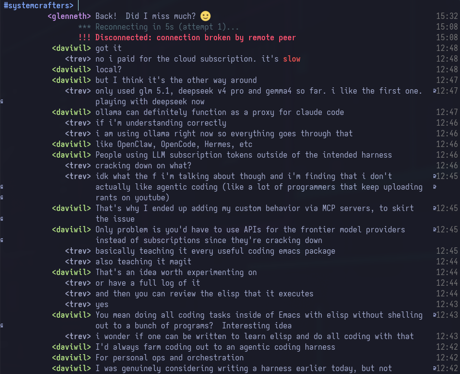

#+TITLE: clatter.el
#+AUTHOR: Glenn Thompson
#+OPTIONS: toc:2

* clatter.el - An IRCv3 Client for Emacs

A dedicated, fully IRCv3-compliant IRC client for Emacs. Pure Elisp. No external dependencies beyond Emacs itself (GnuTLS required for TLS connections).

Spiritual successor to [[https://github.com/glenneth1/CLatter][CLatter]] (the Common Lisp TUI client), redesigned from scratch for Emacs.

#+ATTR_ORG: :width 800

** Features

*** Protocol
- Full IRC protocol (RFC 1459/2812)
- IRCv3 capability negotiation (CAP LS 302)
- SASL authentication (PLAIN, SCRAM-SHA-256, EXTERNAL/certificate)
- IRCv3 message tags (server-time, msgid, batch, etc.)
- Batch message handling (chathistory)
- Labeled responses
- Standard Replies (FAIL/WARN/NOTE) with formatted display
- Strict Transport Security (STS) - auto-upgrade plaintext to TLS
- MONITOR (online/offline tracking)
- Typing indicators (+typing)
- CTCP (VERSION, TIME, PING, ACTION, DCC)
- TLS/SSL with client certificate support
- mIRC color/formatting codes (bold, italic, underline, colors, reverse)
- BOT mode (draft/bot) - [bot] indicator on messages from bots
- WHOX (extended WHO) - bulk account name fetching on channel join
- Channel rename (draft/channel-rename) - auto-updates buffers
- STATUSMSG - prefix-targeted messages with [ops]/[voiced] indicator
- ISUPPORT (005) parameter parsing
- Thread/reply support (draft/reply) - inline reply context display
- Reactions (draft/react) - emoji reactions on messages via TAGMSG

*** Interface
- Buffer-per-channel (native Emacs buffers)
- Newest-at-top message layout (input prompt at top, messages below)
- =auth-source= integration for passwords (.authinfo.gpg, pass, etc.), including server password (PASS)
- Multi-network support
- Non-destructive message suppression, per channel (JOIN, PART, QUIT, NICK, etc.) toggled at runtime with =/suppress= and =/unsuppress=; hidden messages are kept and can be revealed again
- Optional compact presence/moderation events with configurable symbols, burst grouping, and essential, reason, or full context presets
- Buffer truncation (configurable =clatter-buffer-max-lines=, default 10000)
- Flyspell spell-checking in input area (built-in, toggle with =clatter-flyspell-enable=)
- Paste flood protection (warns before sending >3 lines, configurable threshold)
- =/close= command to kill current buffer (PARTs from channels first)
- Reconnect/disconnect status shown inline in channel buffers

*** SOCKS5 / Tor Proxy (clatter-socks)
- Route connections through any SOCKS5 proxy (RFC 1928), including Tor
- =:tor t= shorthand for Tor's local proxy (127.0.0.1:9050); .onion supported
- Username/password auth (RFC 1929); password via plist or auth-source
- Per-network =:proxy= plist, or a global =clatter-proxy= default
- Fail-closed: never falls back to a direct connection if the proxy fails
- Remote DNS (SOCKS5h): the proxy resolves the target, so DNS is not leaked
- Requires builtin TLS (=clatter-tls-method 'builtin=); external-TLS users can
  wrap the client with =torsocks= at the OS level instead

Example:

#+BEGIN_SRC emacs-lisp
(setopt clatter-networks
  '(("libera-tor"
     :server "irc.libera.chat" :port 6697 :tls t :nick "yournick"
     :tor t)))               ;; or :proxy (:type socks5 :host "..." :port 1080)
#+END_SRC

*** Nick Highlighting (clatter-hl-nicks)
- 40-color palette optimized for dark themes
- Hash-based stable colors (same nick = same color across sessions)
- In-text nick highlighting (nicks colorized in message body, not just prefix)
- Nick alias support for consistent colors across nick changes
- URL detection with clickable links (=RET= or mouse click on any URL)
- =clatter-hl-open-url-nearest= opens nearest URL on current line (bind in init.el)
- =M-x clatter-hl-browse-urls= to browse all URLs from the buffer (completing-read picker)
- =M-x clatter-hl-copy-url= to copy a URL from the buffer to kill ring
- Configurable skip-nicks and minimum length

*** Ignore / Filter System
- =/ignore NICK-OR-PATTERN= to hide all messages from a user
- =/unignore NICK-OR-PATTERN= to remove from ignore list
- =/ignore= with no args shows current ignore list
- Glob wildcards (=*= and =?=) supported, case-insensitive
- Filtering is UI-only; ignored messages still appear in logs
- Toggle from action menu with =I=
- Fools (dimmed senders) can be toggled visible/hidden independently with =/toggle-fools=
- Configurable mention matching via =clatter-mention-p-function= (whole-word or substring)

*** URL Title Preview (clatter-url-preview)
- Async URL title fetching (displays inline as system message)
- Cached titles to avoid re-fetching
- Excludes binary/media URLs (.png, .jpg, .mp4, etc.)
- Opt-in: set =clatter-url-preview-enable= to =t=
- Configurable max title length and timeout

*** Channel Logging (clatter-log)
- Automatic logging to =~/.emacs.d/clatter/logs/=
- Daily rotated log files (=network/target-YYYY-MM-DD.log=)
- Buffered writes with configurable flush interval
- Logs PRIVMSG, ACTION, NOTICE, JOIN, PART, QUIT, NICK, TOPIC, KICK, MODE
- =M-x clatter-log-open= to open log for current channel
- =M-x clatter-log-open-directory= to browse all logs
- Per-channel exclusion via =clatter-log-exclude-targets=
- Opt-in: set =clatter-log-enable= to =t=

*** Message Actions (clatter-actions)
- Context-aware action menu on message at point (=C-c C-a=)
- Reply: insert nick at prompt
- Copy: message text, nick, or URL
- WHOIS: query sender info
- Query: open DM with sender
- Inspect: view raw message properties
- Ignore: toggle sender ignore (messages hidden)
- URL collection: list all URLs in buffer

*** Activity Tracking (clatter-track)
- Global mode-line activity indicator
- Unread counts and mention detection per channel
- Priority sorting: mentions > DMs > regular activity
- Clickable mode-line entries (switch to buffer on click)
- Muted targets remain visible but dimmed; for example,
  =(setq clatter-track-muted-channels '(\"*server*\" \"#bots\"))=
- Excluded targets are omitted from every tracker surface; for example,
  =(setq clatter-track-exclude-targets '(\"*server*\"))=
- Consult integration (narrow with =i= in =consult-buffer=)
- =M-x clatter-track-switch= to jump to most urgent activity
- =M-x clatter-track-list= to list all activity

*** Desktop Notifications (clatter-notify)
- Mention, DM, and keyword-triggered notifications
- Uses Emacs-native desktop notifications (D-Bus, Android, Haiku, or Windows), with terminal-notifier on macOS
- Silent delivery failure by default, with an opt-in echo-area fallback
- Per-channel and per-nick muting
- Smart notification rules: per-channel levels (all/mentions/dms/none) with schedule
- DM priority override (always/rules/never)
- Schedule support with 24h ranges, wraps midnight (e.g. 22-8)
- Current-buffer suppression (no noise for what you already see)
- Rate limiting (configurable cooldown per source)
- Optional sound support
- Custom keyword watchlist
- =M-x clatter-notify-toggle= to toggle, =M-x clatter-notify-add-keyword= to add keywords
- =M-x clatter-notify-test= to verify setup

*** Completion (clatter-completion)
- Completion-at-point for nicks, /commands, and #channels
- Integrates with Corfu, Vertico, Orderless (standard Emacs CAPF)
- Nick annotations show channel prefix (@, +, etc.)
- /command annotations show descriptions
- Auto ": " suffix when completing nick at start of input
- TAB triggers completion in input area

*** Raw Protocol Log (clatter-rawlog)
- Full raw IRC traffic inspector
- Color-coded incoming (<< green) and outgoing (>> blue)
- Optional parsed message structure display
- Filter by regex pattern
- Send raw IRC commands directly
- View CAP negotiation state
- =M-x clatter-rawlog-open= to open rawlog

*** Keyword Highlighting
- Highlight custom words in message text (beyond nick mentions)
- Case-insensitive, word-boundary matching
- Configure with =clatter-hl-keywords= (list of strings)
- Distinct face (=clatter-hl-keyword=) for easy visibility

*** Full-Text Search (clatter-search)
- Search across all IRC log history with =grep=
- Two interfaces: dedicated results buffer and =completing-read=
- Filter by network, search current channel with =/searchhere=
- Jump directly to log file at matching line
- Commands: =/search=, =/searchhere=, =/grep=, =/find=
- Also available as =M-x clatter-search= / =M-x clatter-search-completing=

*** Thread/Reply Support
- Incoming replies show context: =↳ sender: preview of original message=
- =/reply TEXT= sends a threaded reply to the message at point
- Uses IRCv3 =+draft/reply= and =msgid= tags
- Reply context is truncated to 60 chars for readability

*** Reactions (draft/react)
- =/react EMOJI= sends an emoji reaction to the message at point
- Incoming reactions display as badges below the referenced message
- Multiple reactions aggregate with counts (e.g. =👍 3 🎉 1=)
- Uses IRCv3 =+draft/react= via TAGMSG

*** Org-mode Integration (clatter-org)
- =org-store-link= support: store links to IRC messages (=irc:network/channel#msgid=)
- =org-capture= helpers: =%(clatter-org-capture-message)= and =%(clatter-org-capture-channel)=
- Log export: =M-x clatter-org-export-log= converts logs to org format grouped by date
- Opt-in: load =clatter-org= and call =clatter-org-setup= to register the
  =irc:= link type with Org (it is not registered automatically, and Org
  is not a hard dependency of clatter):

  #+BEGIN_SRC emacs-lisp
  (with-eval-after-load 'org
    (require 'clatter-org)
    (clatter-org-setup))
  #+END_SRC

*** DCC File Transfer (clatter-dcc)
- DCC SEND receive (XDCC pack downloads)
- Async binary download with 4-byte ack protocol
- Accept/reject prompt with file size display
- Progress reporting (speed, percentage, ETA)
- DCC RESUME/ACCEPT for interrupted transfers
- Auto-accept mode and configurable max file size
- Output path collision avoidance
- Configurable download directory (default =~/Downloads/=)
- =/dcc get BOT #PACK= to request XDCC packs
- =/dcc list=, =/dcc accept=, =/dcc cancel= management commands

*** Autojoin Persistence
- =/autojoin add #channel= saves channel to autojoin list
- =/autojoin remove #channel= removes from autojoin list
- =/autojoin list= shows current autojoin for the network
- Persists via =customize-save-variable= to =custom-file=

*** Inline Image Preview (clatter-image)
- Async inline image display for URLs in messages
- Opt-in: disabled by default (=clatter-image-enable=)
- GUI frames only, graceful no-op in terminal
- Configurable max width/height and file size cap
- Uses async curl subprocess (non-blocking)

*** Channel List Browser (clatter-list)
- Interactive =/list= command with tabulated display
- Sorted by user count (descending)
- Filter by regex (=f= or =/=)
- Join channel with =RET=, refresh with =g=
- Handles large networks efficiently
- Preserves server-side filter on refresh
- Parses mIRC formatting codes in channel topics

*** Server Buffer & WHOIS
- MOTD displayed in server buffer on connect
- Formatted WHOIS output inline: nick, user@host, realname, account, server, channels, idle time, signon date, TLS, operator, away status
- Uses IRCv3 server-time tag for accurate timestamps
- Timestamps reflect when the message was sent, not received
- Essential for bouncer and chathistory accuracy
- Falls back to local time when server-time is unavailable

*** Chat History (clatter-chathistory)
- IRCv3 CHATHISTORY extension support
- Auto-fetches backlog on channel join
- Fetches gap messages on reconnect
- Manual fetch commands for older messages
- Configurable message limit per request
- Works with soju, znc, and compliant servers

*** Bouncer Playback Awareness
- Visual separator for batch-delivered history (chathistory, ZNC playback)
- Start/end markers with message count
- Messages render normally with timestamps between separators
- Works with any IRCv3 BATCH-based playback

*** Channel Preview on Hover
- Eldoc integration: hover over =#channel= names to see topic and user count
- Message info on hover: sender and message ID shown in echo area
- Automatic via =eldoc-mode= in clatter buffers

*** Read Marker (clatter-read-marker)
- IRCv3 read-marker (MARKREAD) protocol support
- Syncs read position across clients via server
- Visual marker line between read and unread messages
- Auto-sends MARKREAD on buffer focus
- Manual mark/query commands

** Requirements

- Emacs 30.1 or later
- GnuTLS (for TLS/SSL connections) - Emacs must be compiled with GnuTLS support
  - On Debian/Ubuntu: =apt install gnutls-bin libgnutls28-dev=
  - On Fedora/RHEL: =dnf install gnutls=
  - On macOS (Homebrew): =brew install gnutls=
  - On Arch: =pacman -S gnutls=
  - Check with: =M-x describe-variable RET gnutls-available-p RET=

Most modern Emacs builds include GnuTLS support by default.

** Installation

*** From MELPA

clatter is available on [[https://melpa.org/#/clatter][MELPA]].  Add MELPA to your package archives if
you have not already:

#+BEGIN_SRC emacs-lisp
(require 'package)
(add-to-list 'package-archives '("melpa" . "https://melpa.org/packages/") t)
#+END_SRC

Then install with:

#+BEGIN_SRC
M-x package-install RET clatter RET
#+END_SRC

Or, with =use-package=:

#+BEGIN_SRC emacs-lisp
(use-package clatter
  :ensure t)
#+END_SRC

*** Manual (from source)

Clone this repository and add to your =load-path=:

#+BEGIN_SRC emacs-lisp
(add-to-list 'load-path "~/path/to/clatter.el")
(require 'clatter)
(clatter-setup)
#+END_SRC

Loading clatter has no side effects: it installs no global hooks and
enables no features.  Call =clatter-setup= once to install the
disconnect/exit cleanup handlers and enable the bundled extras.  Each
extra is gated by its own user option: activity tracking
(=clatter-track-enabled=), notifications (=clatter-notify-enabled=),
chathistory (=clatter-chathistory-enabled=) and read markers
(=clatter-read-marker-enabled=) default on, while channel logging
(=clatter-log-enable=) and URL previews (=clatter-url-preview-enable=)
default off.  Set the relevant option before calling =clatter-setup=.

** Quick Start

#+BEGIN_SRC emacs-lisp
;; Connect to a network
(clatter-connect "libera"
  :server "irc.libera.chat"
  :port 6697
  :tls t
  :nick "yournick"
  :autojoin '("#emacs" "#commonlisp"))
#+END_SRC

Or configure via =customize=:

#+BEGIN_SRC emacs-lisp
(setopt clatter-networks
  '(("libera"
     :server "irc.libera.chat"
     :port 6697
     :tls t
     :nick "yournick"
     :sasl scram-sha-256  ;; or 'plain or 'external
     :autojoin ("#emacs" "#commonlisp"))))
#+END_SRC

Or use =M-x customize-group RET clatter RET= for the full options UI.

** Recommended Configuration (use-package)

A complete =use-package= setup, adapted from one contributed by
[[https://github.com/fmqa][fmqa]]. It binds the common commands, injects a
client certificate into every network for SASL EXTERNAL, and shows activity
crumbs in the mode line of all clatter buffers.

#+BEGIN_SRC emacs-lisp
(use-package clatter
  ;; Installed from MELPA. To track git HEAD instead, add e.g.
  ;; :vc (:url "https://github.com/parenworks/clatter.el.git" :rev :newest)
  :defer t
  :commands clatter-connect
  :bind (:map clatter-mode-map
              ("C-c ."   . clatter-track-switch)
              ("C-c C-." . clatter-track-switch)
              ("C-c :"   . clatter-track-list)
              ("C-c n"   . clatter-nicklist-toggle)
              ("C-c C-n" . clatter-nicklist-toggle))
  :config
  ;; Install cleanup hooks and enable the bundled extras.  Required:
  ;; loading clatter alone has no side effects.
  (clatter-setup)
  ;; Ensure GnuTLS is loaded before connecting.
  (require 'gnutls)
  ;; Present the same client certificate on every configured network
  ;; (for SASL EXTERNAL / CertFP). Adjust the path to your certificate.
  (mapc (lambda (network)
          (setf (cdr network)
                (plist-put (cdr network)
                           :client-cert
                           (file-name-concat
                            user-emacs-directory "clatter" "irc.pem"))))
        clatter-networks)
  :custom
  ;; Show activity crumbs in all clatter buffers, not just the active one.
  (clatter-track-in-buffer-mode-line t)
  ;; (clatter-timestamp-format "%H:%M:%S")
  (clatter-networks
   '(("Libera.Chat"
      :server "irc.libera.chat"
      :nick "yournick" :realname "Your Name"
      :sasl external
      :autojoin ("#emacs" "#commonlisp" "#systemcrafters"))
     ("OFTC"
      :server "irc.oftc.net"
      :nick "yournick" :realname "Your Name"
      :autojoin ("#debian")))))
#+END_SRC

** Keybindings

clatter does not impose any global keybindings. All commands are available via =M-x= and =/slash= commands in the input prompt.

*** Example: Evil leader keys

If you use Evil with a =SPC= leader (via general.el or similar), here is an example configuration:

#+BEGIN_SRC emacs-lisp
(my-leader  ;; replace with your leader definer
  "i"   '(:ignore t :wk "IRC")
  "ii"  '(clatter :wk "Connect to network")
  "id"  '(clatter-disconnect :wk "Disconnect")
  "is"  '(clatter-status :wk "Connection status")
  "it"  '(clatter-track-switch :wk "Jump to activity")
  "il"  '(clatter-track-list :wk "List activity")
  "in"  '(clatter-notify-toggle :wk "Toggle notifications")
  "ik"  '(clatter-notify-add-keyword :wk "Add notify keyword")
  "ir"  '(clatter-rawlog-open :wk "Raw protocol log")
  "io"  '(clatter-hl-browse-urls :wk "Browse URLs")
  "iy"  '(clatter-hl-copy-url :wk "Copy URL")
  "ip"  '(clatter-nicklist-toggle :wk "Toggle nick list"))
#+END_SRC

With Evil, =SPC= only triggers the leader in *normal state*. When you press =i= to enter insert state at the prompt, =SPC= types a space character as expected.

*** Example: Vanilla Emacs

#+BEGIN_SRC emacs-lisp
(global-set-key (kbd "C-c i i") #'clatter)
(global-set-key (kbd "C-c i d") #'clatter-disconnect)
(global-set-key (kbd "C-c i t") #'clatter-track-switch)
(global-set-key (kbd "C-c i l") #'clatter-track-list)
#+END_SRC

** File Structure

| File                    | Description                                   |
|-------------------------+-----------------------------------------------|
| =clatter.el=            | Main entry point, autoloads                   |
| =clatter-protocol.el=   | IRC message parsing/formatting, IRCv3 tags    |
| =clatter-connection.el= | Network I/O, TLS, reconnection                |
| =clatter-cap.el=        | CAP negotiation, SASL authentication          |
| =clatter-handlers.el=   | IRC message dispatch and event handling        |
| =clatter-model.el=      | Channel/nick/buffer state management           |
| =clatter-ui.el=         | Buffer rendering, faces, mode-line, input      |
| =clatter-commands.el=   | User commands (/join, /part, /msg, etc.)       |
| =clatter-config.el=     | User configuration, defcustom, auth-source     |
| =clatter-hl-nicks.el=   | Nick colorization, URL highlighting            |
| =clatter-actions.el=    | Message actions at point                       |
| =clatter-track.el=      | Buffer activity tracking, mode-line indicator  |
| =clatter-notify.el=     | Desktop notifications with IRC rules           |
| =clatter-completion.el= | Completion-at-point for nicks, commands, channels |
| =clatter-rawlog.el=     | Raw IRC protocol inspector/devtools            |
| =clatter-chathistory.el= | IRCv3 CHATHISTORY backlog fetching             |
| =clatter-read-marker.el= | IRCv3 read-marker sync                        |
| =clatter-nicklist.el=   | Channel member sidebar                         |
| =clatter-log.el=        | Channel logging to file with daily rotation    |
| =clatter-url-preview.el= | Async URL title preview                       |
| =clatter-format.el=     | mIRC color/formatting code parser              |
| =clatter-sasl-scram.el= | SASL SCRAM-SHA-256 (RFC 5802)                  |
| =clatter-sts.el=        | IRCv3 Strict Transport Security                |
| =clatter-list.el=       | Interactive channel list browser               |
| =clatter-image.el=      | Inline image preview (opt-in, GUI only)        |
| =clatter-search.el=     | Full-text search across IRC log history        |
| =clatter-org.el=        | Org-mode integration (links, capture, export)  |
| =clatter-dcc.el=        | DCC file transfer (XDCC receive, resume)       |
| =clatter-socks.el=      | SOCKS5 / Tor proxy support                     |
| =clatter-smart.el=      | Adaptive / smart message filtering             |
| =clatter-pals.el=       | Pals, fools, ignore lists, visibility          |

** Companion Packages

clatter.el requires =curl= at runtime for async URL/image fetching.
No Emacs Lisp dependencies beyond Emacs 30.1 itself.

Works well with:

- [[https://github.com/iqbalansari/emacs-emojify][emojify]] - emoji rendering in messages (recommended)
- [[https://github.com/minad/corfu][corfu]] / [[https://github.com/minad/vertico][vertico]] - completion UI for nick/command/channel completion
- [[https://github.com/oantolin/orderless][orderless]] - flexible completion matching
- [[https://github.com/minad/consult][consult]] - =consult-buffer= integration via =clatter-track=

** Contributors

Thanks to the people who have contributed to clatter.el:

- [[https://github.com/fmqa][fmqa]] (F. Magsarian), non-destructive message
  suppression, smart noise filtering, input history, additional WHOIS
  numerics, buffer cleanup hooks, reaction overlay fix, assorted
  nicklist fixes, consolidated CTCP ACTION/NOTICE handling with
  server-time, stricter mention matching, improved /mode for server
  buffers, error numeric display (401/403/404), AWAY status broadcast,
  formatting in part/quit/kick/away messages, channel list robustness,
  and keymap consolidation
- [[https://github.com/trevarj][trevarj]] (Trevor Arjeski), SOCKS5 / Tor
  proxy support, auth-source server password lookup, left-side
  timestamp support, message filling, and fool visibility toggling

** License

MIT
